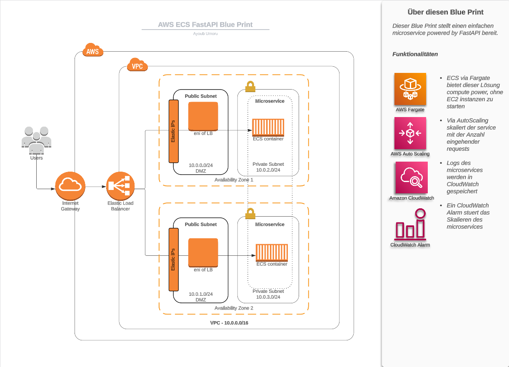

## BluePrint Microservice on ECS
We are working with AWS since a couple of years intensively and gathered a good mix of best-practises and easy to run solutions to demonstate certain aspects of AWS.

This blue prints helps us to explain our customers how the interaction with AWS CDK as IaC works.


## Getting Started 
* Install the aws cli 
  https://docs.aws.amazon.com/cli/latest/userguide/getting-started-install.html

* Install aws cdk
  https://docs.aws.amazon.com/cdk/v2/guide/getting_started.html

## Running 
* Clone the repository
* Run the following to deploy the solution

```  
chmod +x ./scripts/deploy.sh
./scripts/deploy.sh
``` 

* Run the following to destroy the solution
```  
chmod +x ./scripts/cleanup.sh
./scripts/cleanup.sh
``` 


### Info

The solution supports autoscaling - https://docs.aws.amazon.com/cdk/api/v2/docs/aws-cdk-lib.aws_ecs-readme.html#task-auto-scaling

### Contact
Contact us for a consultation or training session, and let's embark on a journey towards growth and success together.

Visit our website at https://www.linkedin.com/company/zerodotfive/ www.zerodotfive.com or call us to get started. The future of your business starts here with ZERODOTFIVE!


**Disclaimer: Blueprint Solution for Non-Production Environments and Training**

The Blueprint Solution provided by ZERODOTFIVE GmbH, enclosed within this readme.md file, is intended solely for non-production environments and training purposes. We strongly advise against using this solution in any production or live systems.

Please note the following important points:

1. **Non-Production Environments Only**: This solution is designed and provided specifically for non-production environments, such as development, testing, staging, or sandbox environments. It is not suitable for deployment in any live or production systems.

2. **Training Purposes**: The blueprint solution is also intended for training purposes, such as learning and experimentation with AWS services and architectures. It should not be utilized in any live customer-facing or revenue-generating applications.

3. **No Warranty or Support**: ZERODOTFIVE GmbH provides this blueprint solution as-is, without any warranty or guarantee of its fitness for any specific purpose. It is your responsibility to thoroughly evaluate and test the solution before using it in any environment.

4. **Limited Security Considerations**: The blueprint solution may not incorporate the same level of security measures as required for production environments. It is crucial to assess and implement appropriate security controls when deploying this solution to ensure data confidentiality, integrity, and availability.

5. **Potential Risks and Limitations**: Usage of this blueprint solution in any production or live systems may lead to unexpected results, performance issues, or disruptions. ZERODOTFIVE GmbH shall not be held liable for any damages or losses arising from the use of this solution in any production or live environment.

By using this Blueprint Solution, you acknowledge and accept the above terms and limitations. It is your responsibility to ensure compliance with all relevant regulations, industry best practices, and AWS guidelines when using this solution.

If you have any doubts or questions regarding the suitability of this blueprint solution for your specific use case, we recommend seeking professional guidance from qualified AWS experts before proceeding.

ZERODOTFIVE GmbH assumes no responsibility or liability for any actions taken based on the use of this AWS Blueprint Solution in any environment.

